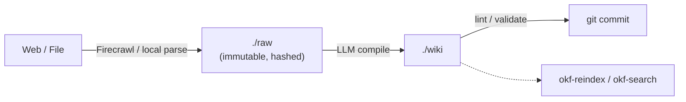

# okf-mcp

A Git-native, offline-first **OKF (Open Knowledge Format) pipeline**: ingest web pages (via Firecrawl) or local files into an immutable `./raw/` archive, compile them into a linked `./wiki/` of concept pages with an LLM, lint the result, and search it — hybrid full-text + dense-vector, merged with Reciprocal Rank Fusion. One binary, usable as a CLI (`okf-mcp <command>`) and as an MCP server (`okf-mcp start` / `okf-mcp http`) for AI coding agents.

[](https://github.com/sponsors/guerchele)

Building and maintaining this took real ideation, time, design effort, and compute (including LLM usage) to get right. If it's useful to you, consider [sponsoring its development](https://github.com/sponsors/guerchele) — any amount helps keep it going. 💛

Ten fixed, well-defined tools — `okf-ingest`, `okf-compile`, `okf-rebuild`, `okf-lint`, `okf-reindex`, `okf-search`, `okf-delete`, `okf-read-index`, `okf-read-concept`, `okf-list-vaults` — not a discovery layer over an unknown API surface. Each does exactly one named thing; `okf-search`'s hybrid ranking is an internal implementation detail, not something you need to know about to use it.

## Pipeline



- **`./raw/`** — append-only. Every ingested source is hashed (SHA-256) and tracked in a content-addressable manifest (`.okf/manifest.json`): re-ingesting unchanged content is a no-op, changed content supersedes the old version (never overwritten), and deletion is a soft tombstone by default (`--purge` for a hard delete).
- **`./wiki/concepts/`** — LLM-compiled, atomic, cross-linked (`[[concept-slug]]`) Markdown pages, one concept per file, each declaring its raw-source provenance in frontmatter.
- **`okf-mcp lint`** — checks for dangling links, missing provenance, and orphan pages before you commit.
- **`okf-mcp reindex` / `okf-mcp search`** — a local Tantivy (BM25) + `sqlite-vec` (dense embeddings) index, merged via RRF; no external service.

See [docs/okf-pipeline-design.md](docs/okf-pipeline-design.md) for the full design rationale and [docs/okf-mcp-implementation-plan.md](docs/okf-mcp-implementation-plan.md) for how it was built. [CHANGELOG.md](CHANGELOG.md) tracks releases; [docs/design-gaps.md](docs/design-gaps.md) tracks what the planning docs missed along the way, for anyone wanting the retrospective lessons rather than just the diffs.

## Install

```bash
cargo build --release
```

Builds two binaries into `target/release/`: `okf-mcp` (the CLI/server below) and `okf-mcp-healthcheck` (used by the Dockerfile's `HEALTHCHECK`). Run `cargo install --path .` instead if you want `okf-mcp` on your `PATH`.

## Quick start

```bash
okf-mcp setup                                          # Firecrawl API key + an LLM provider key
mkdir -p my-vault/.okf && cd my-vault                   # any directory with a .okf/ marker is a vault
okf-mcp ingest https://example.com/some-article
okf-mcp compile --model anthropic/claude-3-5-sonnet
okf-mcp lint
okf-mcp reindex --embeddings
okf-mcp search "what did that article say about X"
```

`okf-mcp run <URL|FILE>` does ingest → compile → lint → commit as one step.

## Vaults

A **vault** is any directory with a `.okf/` marker — the CLI resolves which one to use, in order: an explicit `--vault <name|path>` flag (global, works on every subcommand) → walking up from the current directory looking for `.okf/` → the registry's default vault.

```bash
okf-mcp vault create ~/Vaults/Personal --name personal --description "Personal notes"  # scaffold a brand-new vault
okf-mcp vault add ~/Vaults/Existing --name existing     # register an existing .okf/ directory instead
okf-mcp vault default personal
okf-mcp vault list
okf-mcp vault remove existing        # unregister only — the directory is untouched
okf-mcp vault delete personal --force   # unregister AND permanently delete the directory
okf-mcp search "kubernetes" --all-vaults          # federated search across every registered vault
```

`vault` is also reachable as `kb` — same commands, two names for two audiences (`vault` for Obsidian-oriented workflows, `kb` for OKF-oriented ones): `okf-mcp kb list` behaves identically to `okf-mcp vault list`.

The registry lives at `~/.config/okf/vaults.toml` — deliberately separate from `~/.okf-mcp/` (this binary's own settings), since it's a convention other OKF-format tools could reasonably also read. Every operation is sandboxed to its resolved vault root; an MCP tool call scoped to one vault cannot read or write another's files.

An OKF vault happens to also be a valid Obsidian vault (`.obsidian/` and `.okf/` coexist without collision), so `./wiki/` renders natively with working `[[wikilinks]]` if you open the same directory in Obsidian.

## CLI reference

| Command | Args | Description |
| --- | --- | --- |
| `ingest` | `<URL\|FILE> [--tag <tag>]...` | Fetch a URL (via Firecrawl) or read a local file and add it to the vault's raw sources; `--tag` is repeatable |
| `compile` | `[--model] [--diff] [--concurrency <N>]` | Compile newly-ingested raw sources into wiki concept pages |
| `rebuild` | `[--model] [--force] [--concurrency <N>]` | Recompile the wiki from all active raw sources |
| `models` | `<provider>` | List a provider's available models (e.g. before picking `--model`) |
| `lint` | `[--strict] [--json]` | Check wikilinks, frontmatter, and source provenance in the wiki |
| `reindex` | `[--embeddings]` | Rebuild the local text and vector index used by search |
| `search` | `<query> [-l/--limit] [--json] [--all-vaults]` | Search ingested raw sources and compiled wiki concepts |
| `delete` | `<URL\|FILE> [--purge]` | Remove a source from the vault (soft by default; `--purge` hard-deletes) |
| `run` | `<URL\|FILE> [--tag <tag>]... [--model]` | Ingest, compile, lint, and commit as one step; `--tag` is repeatable |
| `vault list` / `add` / `create` / `remove` (`rm`) / `delete` / `default` | — | Manage vaults / knowledge bases — also reachable as `kb ...` |
| `setup` | — | Configure the Firecrawl API key and an LLM provider key |
| `credentials list` | — | List every account a credential could be saved under, and whether one actually is (never the value) |
| `credentials clear` | `[--provider <name>] [--all] [-y/--yes]` | Delete one (`--provider`) or all (`--all`) saved credentials; prompts for confirmation unless `--yes` |
| `test-connection` | — | Verify Firecrawl is reachable and report which LLM providers are configured |
| `config` | — | Print configuration grouped by source: global/local config files, env vars, vault config, credential presence, and the final resolved result (secrets redacted throughout) |
| `version` | — | Print the installed version |
| `start` / `http` | `[--host] [--port] [--cors-allow]` | Start the MCP server over stdio / HTTP |

Every content-touching subcommand also accepts the global `--vault <name|path>` flag.

### Compiling large corpora

Rough sizing, by file count in `raw/` and typical per-file length:

- **Small** (dozens of files, article-length or shorter) — the default sequential `compile` is fine; there's no meaningful benefit to changing anything.
- **Medium** (hundreds of files) — still fine sequentially, but `--concurrency` starts to save real wall-clock time.
- **Large** (thousands of files, or many long documents) — compile several sources in parallel with `okf-mcp compile --concurrency 8` (same flag on `rebuild`). Honest caveat: raising concurrency trades away some cross-linking completeness within a concurrent batch for throughput, since sources compiled at the same time can't see each other's freshly-created concept pages the way a strictly sequential run can. The existing `lint`/`--fix` pass is the safety net — run it (or pass `--fix` to `compile`/`rebuild`) after a high-concurrency run to repair whatever broken links that trade-off left behind.

`--concurrency` parallelizes *across* sources, not within one, so it won't help with an individual source that's unusually long on its own (e.g. a long chat-export conversation) — watch your provider's context-window limit for those. Run `okf-mcp models <provider>` to see what's currently available, and check the provider's own docs for that model's context-window size rather than relying on a number here.

At very high volume, a local Ollama model (`ollama/<model>`) is worth considering for cost and privacy, at the usual local-model quality/speed trade-off.

Also note: `.okf/config.toml`'s `[compiler].max_tokens` (see [Configuration](#configuration) below) now actually takes effect on every `compile`/`rebuild` call, capping each LLM response.

## MCP tools

| Tool | Args | Description |
| --- | --- | --- |
| `okf-ingest` | `source, tags?, vault?` | Fetch a URL or read a local file and add it to the vault's raw sources |
| `okf-compile` | `diff?, model?, temperature?, base_url_override?, vault?` | Compile newly-ingested raw sources into wiki concept pages |
| `okf-rebuild` | `force?, model?, temperature?, base_url_override?, vault?` | Recompile the wiki from all active raw sources |
| `okf-list-models` | `provider, vault?` | List a provider's available models |
| `okf-lint` | `strict?, vault?` | Check wikilinks, frontmatter, and source provenance in the wiki |
| `okf-reindex` | `embeddings?, vault?` | Rebuild the local text and vector index used by search |
| `okf-search` | `query, limit?, vault?` | Search ingested raw sources and compiled wiki concepts |
| `okf-delete` | `source, purge?, vault?` | Remove a source from the vault |
| `okf-read-index` | `vault?` | Read the wiki's table-of-contents page |
| `okf-read-concept` | `id_or_path, vault?` | Read a single compiled wiki concept page |
| `okf-list-vaults` | — | List every vault registered on this machine |

### Connect an MCP client

**stdio:**

```json
{
  "mcpServers": {
    "okf-mcp": {
      "command": "okf-mcp",
      "args": ["start"]
    }
  }
}
```

Use the absolute executable path if `okf-mcp` is not on the MCP host's `PATH`.

**HTTP:** every request must carry its own Firecrawl `Authorization` header — HTTP transport intentionally never falls back to server-side config for the `okf-ingest` tool's outbound Firecrawl call:

```json
{
  "mcpServers": {
    "okf-mcp": {
      "url": "http://127.0.0.1:3000/mcp",
      "headers": {
        "Authorization": "Bearer <your Firecrawl API key>"
      }
    }
  }
}
```

Keep the listener on localhost unless you've added appropriate network access controls and TLS in front of it. `okf-compile`/`okf-rebuild`'s LLM provider keys are configured server-side (via `okf-mcp setup` or env vars) regardless of transport — they aren't part of this per-request credential model.

## Configuration

| Env var | Purpose |
| --- | --- |
| `OKF_MCP_FIRECRAWL_API_URL` | Firecrawl API base URL (default `https://api.firecrawl.dev`) |
| `OKF_MCP_FIRECRAWL_API_PAT` | Firecrawl personal access token — checked before the OS keychain/encrypted-file fallback `okf-mcp setup` writes to |
| `ANTHROPIC_API_KEY` / `OPENAI_API_KEY` / `GROQ_API_KEY` / `GEMINI_API_KEY` / `OPEN_ROUTER_API_KEY` / `DEEPSEEK_API_KEY` / `XAI_API_KEY` / `TOGETHER_API_KEY` / `OLLAMA_API_KEY` / `MOONSHOT_API_KEY` | LLM provider keys, read by whichever `<provider>/<model>` you pass to `--model` (`anthropic`, `openai`, `groq`, `gemini`, `openrouter`, `deepseek`, `xai`, `together`, `ollama-cloud`, `moonshot` respectively) |
| `OLLAMA_HOST` | Overrides local Ollama's default `http://localhost:11434` (`ollama/<model>` — no key needed; distinct from `ollama-cloud/<model>`, which does) |
| `FOUNDRY_LOCAL_ENDPOINT` | Microsoft Foundry Local's endpoint (`foundry-local/<model>` — no key needed; no hardcoded default since its port is assigned dynamically per machine) |
| `CLAUDE_MAX_API_PROXY_ENDPOINT` | Overrides [`claude-max-api-proxy`](https://github.com/sethschnrt/claude-max-api-proxy)'s default `http://localhost:11434/v1` (`claude-max-api-proxy/<model>` — no key needed; a local OpenAI-compatible proxy that serves requests through an already-authenticated `claude` CLI session, i.e. your Claude Pro/Max subscription instead of per-token API billing) |
| `CUSTOM_LLM_API_KEY` / `CUSTOM_LLM_BASE_URL` | For `custom/<model>` — any other OpenAI-compatible endpoint not listed above |
| `OKF_MCP_LOG_LEVEL` | Log verbosity (`trace`/`debug`/`info`/`warn`/`error`) |
| `FASTEMBED_CACHE_DIR` | Where the ~415 MiB local embedding model is cached (default `<home>/.okf-mcp/models`, absolute regardless of the invoking working directory) |

See `.env.example` for the full list. `--model` always requires an explicit `<provider>/<model_name>` prefix (e.g. `anthropic/claude-3-5-sonnet`, `ollama/llama3.2`) — no "guess the provider" fallback, since that's ambiguous whenever more than one provider's key happens to be set. Falls back to a vault's `.okf/config.toml` `[compiler].default_model` when `--model` is omitted.

```toml
# <vault>/.okf/config.toml
[compiler]
default_model = "anthropic/claude-3-5-sonnet"
temperature = 0.2
max_tokens = 4096

# Per-provider overrides — CLI compile/rebuild/run only (an MCP call's own
# base_url_override argument, if supplied, still wins over this).
[providers.custom]
api_key_env = "MY_CUSTOM_KEY"
base_url = "https://my-openai-compatible-endpoint.example/v1"
```

## Docker

```bash
# Stdio: the MCP client launches this one-off process and owns its stdin/stdout pipes
docker compose run --rm -T okf-mcp

# HTTP: a long-running network endpoint published on http://localhost:3000
docker compose up okf-mcp-http
```

Both services read configuration from a local `.env` file (copy `.env.example`), and mount `~/.okf-mcp` (credentials), `~/.config/okf` (vault registry), and `~/okf-vaults` (vault data, at `/vaults` in the container) from the host.

For iterative local development against your working tree instead of a pinned image, use `docker-compose.dev.yml`:

```bash
docker compose -f docker-compose.dev.yml up --build
```

## Observability & Resilience

### Logging

Structured logs go to **stderr** (never stdout, which is reserved for MCP JSON-RPC frames on stdio transport): JSON by default, pretty-printed automatically when stderr is an interactive TTY. Level is controlled by `OKF_MCP_LOG_LEVEL` (default `info`), passed straight through to `tracing_subscriber::EnvFilter`, so directive syntax works too:

```bash
OKF_MCP_LOG_LEVEL="okf_mcp=debug,warn" okf-mcp start
```

### OpenTelemetry tracing

An OTLP/HTTP trace exporter is built at startup; if it fails to build, tracing export is silently skipped. Point it at a collector with the OTLP SDK's own standard env vars:

```bash
OTEL_EXPORTER_OTLP_ENDPOINT=http://otel-collector:4318 okf-mcp start
```

Defaults to `http://localhost:4318` if unset.

### Metrics

`GET /metrics` (HTTP transport only) serves a minimal hand-rolled Prometheus-text counter store — currently `http_requests_total`.

### Circuit breaker, retries, and rate limiting

Outbound Firecrawl calls (`services/api_client.rs`) pass through a rate limiter, then a circuit breaker, then a retry loop:

| Behavior | Configurable? | Knob | Default |
| --- | --- | --- | --- |
| Request timeout | Yes | `timeout_ms` | 30000 ms |
| Retry attempts | Yes | `retry_attempts` | 3 (immediate retry, no backoff) |
| Rate limit | Partially | `rate_limit` | 100 calls; 1s window, not configurable |
| Circuit breaker | No | — | opens after 5 consecutive failures, 30s half-open trial |

### Health checks

`GET /healthz` (HTTP transport only) reports process health — `Healthy` by default, since (unlike the old generic-catalog scaffold this project started as) there's no single compiled-in resource to check; each tool call resolves and validates its own vault per-call. `okf-mcp-healthcheck` (the Dockerfile's `HEALTHCHECK`) probes `/healthz` when the configured transport is HTTP, or checks the resolved vault's `.okf/` directory is readable for stdio deployments, which have no HTTP endpoint to probe.

### Credential storage

`okf-mcp setup` writes credentials to the OS-native secret store via the `keyring` crate (macOS Keychain / Windows Credential Manager / Linux Secret Service), under service `okf-mcp` — the Firecrawl key under account `firecrawl`, each LLM provider key under `llm-<provider>`. Falls back automatically to an AES-256-GCM-encrypted file at `~/.okf-mcp/credentials.enc` if no OS keychain backend is available.

`okf-mcp credentials list` is `setup`'s read-only counterpart: it prints every account name a credential could be saved under (known providers, any configured custom providers, and `firecrawl`) and whether one actually is — never the credential's value. `okf-mcp credentials clear --provider <name>` (or `--all`, for every saved credential) deletes the matching keychain/encrypted-file entries; it prints what it's about to clear and asks for confirmation first, unless `--yes`/`-y` is passed.

## Testing

```bash
cargo test
```

### Pre-commit hook

A checked-in hook runs `cargo fmt --check` and `cargo clippy --all-targets -- -D warnings` before each commit — the same two gates CI checks first — so formatting/lint drift never reaches a commit in the first place. Enable it once per clone:

```bash
git config core.hooksPath .githooks
```

## Coverage

```bash
bash scripts/coverage.sh
```

Requires Python 3, `cargo-llvm-cov`, and the `llvm-tools-preview` Rust component.

## Profiling

```bash
bash scripts/profile.sh        # CPU profiling via samply, over search::hybrid_search
bash scripts/profile-heap.sh   # steady-state heap profiling via dhat-rs
```

Both run against a small fixture vault the profiling harness (`examples/profile_search.rs`) builds itself, so no real vault or Firecrawl/LLM credentials are needed. Requires [samply](https://github.com/mstange/samply) (`cargo install samply`) for CPU profiling.

## License

MIT — see [LICENSE](LICENSE).
