# okf-mcp-rs: From Generic Firecrawl Proxy to a Purpose-Built OKF Pipeline

## Context

`okf-mcp-rs` is currently a scaffold generated by "mcpify" from Firecrawl's OpenAPI spec. It exposes exactly **3 generic MCP tools** — `search`, `get`, `call` — that let an LLM discover and invoke *any* Firecrawl API operation via a compiled-in SQLite catalog (`mcp_store.db.zst`) of every endpoint's schema, plus a semantic index over that catalog. There is no OKF-specific logic anywhere; "okf" is currently just the binary/crate name.

The user wants to repurpose this project into an actual implementation of the **OKF (Open Knowledge Format) pipeline** designed in a Gemini conversation (full text fetched and will be saved to `docs/okf-pipeline-design.md` as the first implementation step): a Git-native, offline-first knowledge engine for AI agents — `[Web/File] → ./raw (immutable, hashed) → LLM compile → ./wiki (concept graph) → lint/validate → git commit`, with reindex/search on top, exposed via both a CLI (`okf-mcp`) and MCP tools (`okf-mcp start`/`http`).

Key reuse constraint: the existing `src/services/api_client.rs` HTTP-dispatch stack (rate limiter → circuit breaker → retry → reqwest, with `AuthManager`-injected bearer auth) is generic, resilient HTTP-calling infrastructure that currently drives the generic Firecrawl proxy. It should be **repurposed, not discarded**, to call Firecrawl's scrape endpoint specifically as the web-fetch step of the new `ingest` pipeline stage — this is "the firecrawl API HTTP channel" the user referred to.

Decisions locked in by the user during scoping (via clarifying questions and mid-turn instructions):
1. **Full pipeline in one pass**: ingest, compile (LLM-based raw→wiki synthesis, multi-provider routing), lint, reindex, search — not a cut-down MVP.
2. **Firecrawl surface = ingestion-only.** The old generic `search`/`get`/`call` tools (proxy-any-Firecrawl-operation) are fully dropped. No escape-hatch generic-call tool survives.
3. **Multi-vault support included now**: a vault registry, `--vault` flag / `vault` MCP param, CWD `.okf/` marker walk-up, path sandboxing, per-vault search index.
4. **Tool/command descriptions must not frame this as "semantic search/discovery"** — the old server literally advertised itself as "Exposes exactly 3 tools... backed by an embedded semantic database" because its whole value was discovering an unknown API surface. The new tools are fixed, well-defined, single-purpose operations (`okf-ingest`, `okf-lint`, ...) — describe them plainly by what they do, not by search technique.
5. **Hybrid BM25 + dense-vector search is wanted** (confirmed) — implemented via Tantivy (BM25) + the existing `fastembed`-based `embedding_service` (dense), merged with Reciprocal Rank Fusion. This is an internal implementation detail of `okf-search`, not something the tool description markets as "semantic" (per #4).
6. **No Merkle tree** (confirmed, twice). Flat per-file SHA-256 in a CAS manifest (`.okf/manifest.json`) is the change-detection mechanism; Git's own commit→tree→blob structure is the underlying integrity layer. Chunk-level Merkle trees are explicitly out of scope, noted as future work only.
7. **Setup wizard's "Firecrawl base URL" prompt gets a real default**: `https://api.firecrawl.dev`, so a user can just hit enter instead of needing to know Firecrawl's URL.
8. **A `docker-compose.dev.yml`** is added alongside the existing `docker-compose.yml`, building from the local `Dockerfile` for iterative development (as opposed to the existing file's prebuilt-image-style services).
9. Dead code (`cache_manager.rs`, `correlation_context.rs`, `tests/runtime_paths.rs`, unused `oauth2`/`rsa`/`sha1` deps) is removed as part of this work.

Judgment calls resolved during planning (flagged as risks by the design pass, decided here so implementation isn't blocked):
- **`.docx` parsing**: use the `docx-rs` crate (pure Rust, no external `pandoc` dependency, keeps single-static-binary distribution intact).
- **LLM provider routing**: use the `genai` crate (unified async client across Anthropic/OpenAI/Groq/Ollama/custom OpenAI-compatible endpoints); verify its exact current API against docs.rs at implementation time since the crate has had breaking changes across versions — treat the sketch below as intent, not a locked signature.
- **Provider inference from a bare model name** (no `provider/` prefix): dropped as a feature. `--model`/`model` always requires an explicit `<provider>/<model>` prefix, or falls back to `.okf/config.toml`'s `[compiler].default_model`. No "guess from whichever env var happens to be set" behavior — too ambiguous when multiple provider keys are configured.
- **Git integration**: shell out to the system `git` binary via `std::process::Command` rather than adding `git2` (libgit2) as a dependency — simpler, and this project already assumes a `git`-managed vault rather than owning repo lifecycle (it never runs `git init`).
- **Tantivy index directory**: gitignored and rebuilt via `okf-mcp reindex`, same pattern as the old (deleted) `mcp_store*.db` gitignore rule.
- **Embedding granularity**: `search::index::reindex` embeds wiki/raw content **per markdown section** (split on `##`-level headings, falling back to whole-file for short documents), not one vector per whole file — long Firecrawl-scraped raw pages and wiki concept pages both benefit from section-level precision, and this matches how `hybrid_search` needs to return a specific snippet, not just a whole-file hit.
- **Compile apply semantics**: per-raw-source apply-and-continue (one bad LLM response doesn't block the rest of a multi-source compile run); the post-compile `lint` pass and git commit are the safety net that surfaces any resulting inconsistency, matching the design's own "Contradiction Flag triggers human diff approval" spirit.
- **Vault registry location**: `~/.config/okf/vaults.toml`, deliberately separate from `~/.okf-mcp/` (this binary's own credentials/config) since the registry is a cross-tool convention other OKF-format consumers (e.g. an Obsidian plugin) might reasonably also read.
- **Env var prefix**: the current code hardcodes `OKF_MCP_RS_*` (see `src/cli/setup_wizard.rs`'s `OKF_MCP_RS_URL`/`OKF_MCP_RS_AUTH_METHOD`/etc., and its own test asserting `OKF_MCP_RS_CLIENT_ID`). Per explicit instruction, **drop the `_RS_` infix**: rename every env var to `OKF_MCP_*` (`OKF_MCP_URL`→`OKF_MCP_FIRECRAWL_BASE_URL`, `OKF_MCP_FIRECRAWL_API_KEY`, `OKF_MCP_LOG_LEVEL`, etc.). This touches `core/config_manager.rs` and `core/auth/auth_manager.rs`'s env-prefix constant(s), `cli/setup_wizard.rs`'s hardcoded `format!("OKF_MCP_RS_{}", ...)`/literal strings and its own unit tests' assertions, `.env.example`, `docker-compose.yml`'s `environment:` block, and `README.md`'s env-var table — grep for `OKF_MCP_RS` across the repo at implementation time to make sure every occurrence is caught, not just the ones enumerated here. Breaking for anyone with an existing `.env`/exported env vars, but the user has explicitly asked for the shorter prefix over continuity.
- **Firecrawl endpoint**: `POST https://api.firecrawl.dev/v2/scrape` with `{"url": "..."}`, reading `data.markdown` from the response — verify exact path/response shape against Firecrawl's current docs at implementation time (Firecrawl has versioned its API before).

---

## Cargo.toml: publish-readiness metadata

The user asked to flip `Cargo.toml` to publishable (`publish = true`, i.e. remove the current `publish = false`) and pointed at mcpify's own Rust generator template as the reference for what fields that requires. Fetched `src/targets/rust/templates/Cargo.toml.tera` from `github.com/guercheLE/mcpify` directly: it has a `publish_registry`-gated branch that, when publishing is enabled, emits `repository`, `license`, `readme`, `authors`, `keywords`, `categories`, `exclude` (all sourced from a `publication:` block — this repo's `.mcpify/settings.yaml`, being deleted per the cleanup plan above, already has this exact shape: `license: MIT`, `readme: README.md`, `repository: null`, `authors: []`, `keywords: []`, `categories: []`, `exclude: []`). The `publish = false` branch instead adds `[package.metadata.dist] dist = true` as a cargo-dist override — that override becomes unnecessary once `publish` is true, since cargo-dist treats a publishable crate as release-worthy by default.

Concrete `[package]` changes to `Cargo.toml`:
- Remove `publish = false` (omitting the field defaults to publishable; crates.io's own field is implicit-true, so no literal `publish = true` line is actually required — but the plan's intent, dropping the opt-out, is what matters).
- Add `repository = "https://github.com/guercheLE/okf-mcp-rs"` (matches the existing `origin` remote) — also independently required by `dist-workspace.toml`'s `ci = "github"` setting (`dist build` fails without it).
- Add `license = "MIT"` (matches the existing `LICENSE` file).
- Add `readme = "README.md"`.
- Add `authors = ["Luciano Evaristo Guerche (Gorše) <guerchele@gmail.com>"]` — inferred from the repo's git user config; confirm with the user before publishing since this becomes public crates.io metadata.
- Add `keywords` (max 5, crates.io-validated): `["mcp", "okf", "knowledge-graph", "firecrawl", "agent"]`.
- Add `categories` (must be valid crates.io category slugs): `["command-line-utilities", "development-tools"]`.
- Add `exclude`: at minimum `["docs/*", ".github/*"]` — revisit once the new `dev-vault/`-style local fixtures (if any get created for manual testing per the Dev docker-compose section) exist, so they don't ship in the published crate tarball.
- Also fill in `LICENSE`'s currently-empty `Copyright (c) ` line (e.g. `Copyright (c) 2026 Luciano Evaristo Guerche (Gorše)`) while touching publish metadata, since an empty copyright holder on a published crate's license file is a loose end worth closing at the same time — flagged here for confirmation rather than assumed silently.

This is an independent, small change — apply it early (can be folded into Phase 12's docs/deps cleanup, or done standalone before that if the user wants publish-readiness sooner).

---

## Step 0 — Save planning artifacts (first action, before Wave 0)

Two files land in `docs/` before any code changes begin:
1. `docs/okf-pipeline-design.md` — the full fetched Gemini conversation (already retrieved in this session), saved verbatim as a durable, citable reference for the rest of the implementation and for anyone reading the repo later.
2. `docs/okf-mcp-implementation-plan.md` — this implementation plan document itself (the one being approved right now), so the plan that was actually agreed on is preserved in the repo alongside the design source it's based on, not left to live only in an external plan-mode file.

Delete `docs/SCHEMA_VERSIONS.md` (dead, catalog-specific) as part of the same commit.

---

## Target module structure

```
src/
├── main.rs                 # rewrite: new Cli/Command enum, global --vault flag, bootstrap order
├── lib.rs                  # rewrite module list
├── cli/
│   ├── ingest.rs            compile.rs   rebuild.rs   lint.rs   reindex.rs   delete.rs   vault.rs   run.rs   (new)
│   ├── search.rs                                                              (rewrite: queries .okf/index.db)
│   ├── setup.rs / setup_wizard.rs / test_connection.rs / config.rs / version.rs   (adapt)
│   └── call.rs, get.rs, versions.rs                                          (delete)
├── core/
│   ├── vault_registry.rs, vault_resolver.rs                                  (new — §Multi-vault)
│   ├── config_schema.rs, config_manager.rs                                   (adapt — Firecrawl-specific Config fields)
│   ├── circuit_breaker.rs, rate_limiter.rs, errors.rs, logger.rs, otel.rs,
│   │   shutdown_handler.rs, health_check_manager.rs, component_registry.rs,
│   │   sanitizer.rs, log_transport.rs, api_url_builder.rs, credential_storage.rs   (keep as-is)
│   ├── cache_manager.rs, correlation_context.rs                              (delete — confirmed dead)
│   └── mcp_server.rs                                                         (rewrite — new tool set, renamed struct)
├── auth/                    (keep shape; PAT strategy becomes the Firecrawl bearer-key strategy; credential_storage
│                              reused for both the Firecrawl key and each LLM provider key under distinct account names)
├── services/
│   ├── api_client.rs        (keep dispatch mechanics; add a narrow `scrape_url()` for Firecrawl)
│   ├── embedding_service.rs (keep fastembed plumbing; re-target at wiki/raw content, section-chunked)
│   └── llm_client.rs        (new — genai-backed provider/model resolution)
├── ingest/                  (new: web.rs [Firecrawl], local.rs [.md/.txt/.pdf/.docx], frontmatter.rs, pipeline.rs)
├── manifest/                (new: model.rs [CAS + tombstone], store.rs [load/save .okf/manifest.json])
├── compiler/                (new: provider.rs, prompts.rs, operations.rs, driver.rs)
├── validator/                (new, replaces src/validation/: wikilink.rs, frontmatter.rs, rules.rs, report.rs)
├── search/                   (new: index.rs [tantivy], vectors.rs [sqlite-vec], rrf.rs, query.rs)
├── storage/                   (new: git.rs [shell out], fs_ops.rs, bundle.rs [okf.json])
├── http/                       (keep shape; server.rs adapts to serve the new tool router + vault threading)
├── tools/                      (delete search_tool.rs/get_tool.rs/call_tool.rs; business logic lives directly in
│                                 ingest/compiler/validator/search modules, with cli/* and mcp_server.rs as thin adapters)
├── data/                        (delete entirely — Firecrawl-catalog SQLite schema no longer applies)
├── validation/                  (delete entirely — generated_schemas.json.zst was Firecrawl-catalog-specific)
└── bin/
    ├── populate_embeddings.rs    (delete)
    └── healthcheck.rs             (rewrite — see Phasing §11)

tests/  → cli_smoke.rs (rewrite), manifest_cas.rs / lint_rules.rs / vault_sandboxing.rs / hybrid_search_rrf.rs /
          mcp_tool_surface.rs (new), embeddings_populated.rs / schema_references.rs / runtime_paths.rs (delete)

Also delete: mcp_store.db.zst, .mcpify/

Keep and adapt (per the epic-completion verification gate — see §Verification): `examples/profile_search.rs` (rewrite to profile `search::query::hybrid_search` instead of the old catalog search — likely rename to `examples/profile_search.rs` still, just re-targeted), `scripts/profile.sh` (CPU profiling via samply, re-pointed at the new example binary), `scripts/samply_to_text.py` (unchanged — format-agnostic profile-to-text converter), `scripts/profile-heap.sh` (dhat heap profiling, re-pointed at whichever new hot path — `ingest`/`compile`/`reindex` — is being profiled). `scripts/coverage.sh` + `check_production_coverage.py` are already generic and unaffected.
```

Runtime artifacts (per-vault, created at runtime, never compiled in):
```
<vault-root>/
├── .okf/{config.toml, manifest.json, index.db/{tantivy/, vectors.sqlite}}
├── raw/*.md
└── wiki/{index.md, log.md, concepts/*.md, deprecated/*.md}
```

---

## Data model

**Manifest** (`.okf/manifest.json`, via `manifest::model`): `Manifest { sources: HashMap<uri, SourceEntry> }`; `SourceEntry { active_hash: Option<String>, history: Vec<SourceVersion> }`; `SourceVersion { raw_id, hash, ingested_at, status: SourceStatus }`; `SourceStatus::{Active, Superseded{by_raw_id}, Tombstoned{reason, tombstoned_at}}`. `Manifest::record_ingest(uri, hash, raw_id, now) -> IngestOutcome{NoOp|New|Superseded}` implements the CAS update/no-op/supersede logic; `tombstone`/`purge` implement soft/hard delete. Saved via write-tmp-then-rename for crash-atomicity.

**Vault registry** (`~/.config/okf/vaults.toml`, via `core::vault_registry`): `VaultRegistry { default: Option<String>, vaults: HashMap<name, VaultEntry{path, description}> }`.

**`.okf/config.toml`** (per-vault compiler/provider settings): `[compiler] default_model, temperature, max_tokens` + `[providers.<name>] api_key_env, base_url` — stores *where* to find a key (env var name), never the key value itself.

**`.okf/index.db/`**: a directory holding `tantivy/` (BM25 index over `path`/`title`/`body`/`tags`/`type` fields) and `vectors.sqlite` (a fresh `rusqlite` + `sqlite-vec` database — new schema: `documents(path PK, doc_type, title, content_hash, updated_at)` + `document_vectors` vec0 virtual table, one row per content *section*, not per file). Structurally modeled on `src/data/store.rs`'s connection-caching/sqlite-vec-registration pattern, but a fresh implementation since the old schema/compile-time-embedding approach doesn't apply to mutable, per-vault runtime data.

---

## CLI and MCP tool surface

`--vault <name|path>` is a **global** clap flag (`#[arg(long, global = true)]` on `Cli`), resolved once in `main()` via `core::vault_resolver::resolve_vault`: explicit `--vault` → CWD walk-up for a `.okf/` marker → registry default.

| CLI | MCP tool | Args | Description (plain, non-"semantic") |
|---|---|---|---|
| `ingest <URL\|FILE> [--tag]` | `okf-ingest` | `source, tag?, vault?` | Fetch a URL or read a local file and add it to the vault's raw sources |
| `compile [--diff] [--model]` | `okf-compile` | `diff?, model?, options?, vault?` | Compile newly-ingested raw sources into wiki concept pages |
| `rebuild [--force] [--model]` | `okf-rebuild` | `force?, model?, vault?` | Recompile the wiki from all active raw sources |
| `lint [--strict] [--json]` | `okf-lint` | `strict?, vault?` | Check wikilinks, frontmatter, and source provenance in the wiki |
| `reindex [--embeddings]` | `okf-reindex` | `embeddings?, vault?` | Rebuild the local text and vector index used by search |
| `search "<q>" [--limit] [--json] [--all-vaults]` | `okf-search` | `query, limit?, vault?` | Search ingested raw sources and compiled wiki concepts |
| `delete <URL\|FILE> [--purge]` | `okf-delete` | `source, purge?, vault?` | Remove a source from the vault (soft by default; `--purge` hard-deletes) |
| `run <URL\|FILE>` | — | — | Run ingest, compile, lint, and commit as one step |
| — | `okf-read-index` | `vault?` | Read the wiki's table-of-contents page |
| — | `okf-read-concept` | `id_or_path, vault?` | Read a single compiled wiki concept page |
| `vault list / add / default` | `okf-list-vaults` | `{}` | List every vault registered on this machine |
| `setup` | — | — | Configure the Firecrawl API key and an LLM provider key |
| `test-connection`, `config`, `version`, `start`, `http` | — | — | kept, adapted |

`versions` is dropped (meaningless without a compiled-in catalog). MCP tool names use hyphens (`okf-ingest`, not `okf_ingest`) — set explicitly via `#[tool(name = "okf-ingest")]` (or equivalent rmcp attribute) on each handler, since rmcp's macro otherwise derives the tool name from the Rust method's snake_case identifier. Tool bodies live once each in `ingest`/`compiler`/`validator`/`search`/`manifest`, with `cli/*.rs` and `core/mcp_server.rs`'s `#[tool]` methods as thin adapters over the same function — avoiding a parallel `tools/` wrapper layer.

`core/mcp_server.rs`'s `ServerHandler::get_info()` instructions text must drop the old "Exposes exactly 3 tools... backed by an embedded semantic database" framing entirely and instead plainly list the fixed tool set and what each does.

---

## Firecrawl reuse plan

Reused as-is: `ApiClient::dispatch` (retry loop, `Content-Length: 0` workaround), `CircuitBreaker`, `RateLimiter`, `api_url_builder::build_api_url`, `AuthManager::apply_auth_headers`, `credential_storage::{save_credential, load_credential}` (Firecrawl key stored under account `"firecrawl"`; each LLM provider key under `"llm-<provider>"`).

New, narrow addition: `ApiClient::scrape_url(&self, url: &str, auth_manager: &mut AuthManager) -> anyhow::Result<Value>` — builds the Firecrawl `/v2/scrape` request directly (no `EndpointRecord`/generic-operation machinery, since there's exactly one fixed operation now), runs through the same rate-limiter → circuit-breaker → `dispatch()` chain. `ingest::web::fetch_and_clean_url` calls it and extracts `data.markdown`.

`Config` (`core/config_schema.rs`) gets Firecrawl-specific fields: `firecrawl_base_url: String` (default `"https://api.firecrawl.dev"`) replacing the current generic `url` field, `auth_method` narrows to mean "how the Firecrawl key is presented" (stays `AuthMethod::Pat` = bearer token).

New code (no existing equivalent): `ingest::local::parse_local_doc` (`.md`/`.txt` passthrough, `.pdf` via a PDF-text-extraction crate, `.docx` via `docx-rs`), `ingest::frontmatter::{RawFrontmatter, write_raw_blob}` (YAML frontmatter + `sha2::Sha256` hashing, both already dependencies), `ingest::pipeline::process_ingest` (orchestrates fetch/parse → hash → manifest CAS update → conditional write).

---

## LLM compile-stage plan

`compiler::provider::LLMCompilerDriver` wraps a `genai::Client`; `execute_compile_prompt(model_spec, system_prompt, user_prompt, temperature?, base_url_override?)` parses `<provider>/<model>` (required — no bare-name inference, per the resolved judgment call above) and executes the chat request. Before constructing the client, check `credential_storage::load_credential("llm-<provider>")` and seed the provider's expected env var if unset, so a key saved via `okf-mcp setup` works without manual exporting.

Model spec resolution order: `--model`/MCP `model` arg → `.okf/config.toml`'s `[compiler].default_model` → error requiring one of the above.

`compiler::prompts::COMPILER_SYSTEM_PROMPT` encodes the design doc's five compilation rules (source-of-truth = ACTIVE manifest entries only; one concept per file; `[[concept-slug]]` wikilinking; strict provenance in frontmatter `sources:`; conflict resolution via a `## Contradictions & Evolutions` section) plus the JSON-only output contract. `build_compile_user_prompt(active_raw, superseded_raw?, existing_related_wiki_pages)` assembles the three labeled sections from the design doc; `existing_related_wiki_pages` comes from running `search::query::hybrid_search` against the raw source's own content, capped at ~5 results.

`compiler::operations::{CompileOperation, CompilePayload, apply_operations}` parses the model's `{"operations": [...]}` JSON (rejecting any non-JSON/prose-wrapped response outright) and applies `CREATE_OR_UPDATE`/`DELETE` atomically (write-tmp + rename), sandboxing every LLM-supplied path via `vault_resolver::sandbox_path` before touching disk — this is the one place untrusted, model-generated path strings enter the system.

`compiler::driver::compile`/`rebuild` orchestration: select raw sources (diff-only = ACTIVE entries not yet referenced by any wiki page's `sources:`; `rebuild --force` = all ACTIVE entries) → per source: build prompt → call LLM → parse → apply (per-source apply-and-continue, per the resolved judgment call) → immediately run `validator::rules::lint` and surface new failures → regenerate `wiki/index.md` from concept-page frontmatter.

---

## Multi-vault plan

`core::vault_resolver::resolve_vault(explicit: Option<&str>) -> PathBuf`: explicit `--vault`/`vault` param (resolved via registry name lookup, else treated as a literal path) → walk up from CWD looking for a `.okf/` directory → `VaultRegistry::default_path()`.

Path sandboxing (single enforcement chokepoint, used by every module that touches disk — `ingest`, `manifest`, `compiler::operations`, `validator`, `search::index`): `core::vault_resolver::sandbox_path(vault_root, relative) -> anyhow::Result<PathBuf>` canonicalizes and rejects anything that resolves outside `vault_root`.

Per-vault index isolation: `search::index::open_or_create(vault_root)` derives all paths from the resolved vault root — `okf-mcp reindex` inside one vault cannot structurally touch another vault's files.

MCP: every content-touching tool resolves `vault` **per call** (not once at server startup), since one long-lived `start`/`http` process may serve requests scoped to different vaults across calls. `okf-list-vaults`/`okf-mcp vault list` read the registry directly.

Cross-vault wikilinks (`[[vault::concept]]`) are recognized and flagged by `validator::wikilink` as informational, never auto-resolved or generated by the compiler. `--all-vaults` search iterates the registry, running `hybrid_search` per vault and merging by score with vault-tagged results.

---

## Search: hybrid BM25 + vector (confirmed, no Merkle tree)

`search::index` builds/updates a Tantivy index over `raw/` + `wiki/` content on `okf reindex` (skipping TOMBSTONED-only raw entries per the manifest). `search::vectors` embeds content **per markdown section** via the existing `embedding_service` (reusing the `all-mpnet-base-v2` model already vendored) into `vectors.sqlite`'s `sqlite-vec` table, keyed by content hash so unchanged sections aren't re-embedded on `--embeddings` reindex. `search::rrf::rrf_merge(bm25_results, vector_results, k=60)` combines both ranked lists. `search::query::hybrid_search(vault_root, query, limit)` is the single entry point both `okf-mcp search` and the `okf-search` MCP tool call — internally hybrid, but its description/help text (per confirmed constraint #4) just says "Search ingested raw sources and compiled wiki concepts," not "AI-powered semantic search."

Change detection for the manifest/CAS layer stays flat SHA-256 per file (no tree); Git itself is the durable Merkle-structured history once `storage::git` commits validated bundles.

---

## Setup wizard change

`src/cli/setup_wizard.rs::prompt_base_url` currently does `inquire::Text::new("Firecrawl base URL:").prompt()` with no default. Change to `inquire::Text::new("Firecrawl base URL:").with_default("https://api.firecrawl.dev").prompt()`, so hitting enter accepts Firecrawl's real cloud endpoint. Also extend the wizard to prompt for (optional) LLM provider + API key for the compile stage, persisted the same way (via `save_credential` under `"llm-<provider>"`), since `compile`/`rebuild` need this to function.

---

## Dev docker-compose file

Add `docker-compose.dev.yml` alongside the existing `docker-compose.yml`. Unlike the existing file (which builds once and runs a fixed `command`), the dev file is meant for iterative local development against the local `Dockerfile`:
- A single `okf-mcp-dev` service, `build: { context: ., dockerfile: Dockerfile }` (explicit, so it's obviously pointing at the local Dockerfile rather than a registry image), `command: ["http", "--host", "0.0.0.0", "--port", "3000"]`, `env_file: .env`, ports `3000:3000`.
- Volume-mounts a local vault directory (e.g. `./dev-vault:/vault`) plus `~/.okf-mcp:/root/.okf-mcp` and `~/.config/okf:/root/.config/okf` (registry), so vault content and credentials persist across rebuilds and are inspectable from the host.
- No `stdin_open`/`tty` (dev iteration targets the HTTP transport for easy `curl`/browser testing; stdio dev-looping is better done by running the binary directly via `cargo run -- start`).

---

## Phasing — parallel tracks

Laid out as tracks/workstreams rather than a strict numbered sequence, so independent pieces can be built concurrently (by separate agents/sessions or just interleaved) instead of waiting on each other. Each track lists its own module-level unit tests inline (per the resolved judgment call to write module tests alongside their module, not in one late catch-all step). Two hard synchronization points exist: **Sync A** (everything in Wave 1 must land before Wave 2 starts) and **Sync B** (Wave 2 must land before Wave 3 starts).

**Wave 0 — fully independent, start immediately, zero dependencies on anything else:**
- **T0.1 Cleanup**: delete `cache_manager.rs`, `correlation_context.rs`, `tests/runtime_paths.rs`, drop `oauth2`/`rsa`/`sha1` deps. Confirm clean `cargo build && cargo test` baseline.
- **T0.2 Cargo.toml publish metadata**: apply the §Cargo.toml: publish-readiness metadata changes (`publish` removal, `repository`/`license`/`readme`/`authors`/`keywords`/`categories`/`exclude`, LICENSE copyright line).
- **T0.3 docker-compose.dev.yml**: add the new dev compose file (§Dev docker-compose file) — doesn't depend on any Rust code changes.
- **T0.4 Env var rename**: `OKF_MCP_RS_*` → `OKF_MCP_*` across `config_manager.rs`/`auth_manager.rs`/`setup_wizard.rs`/`.env.example`/`docker-compose.yml`. Mechanical, independent of the pipeline features themselves (though it does touch `setup_wizard.rs`, so land it before T2.1 also touches that file for the default-URL change, or accept a small merge — either order is dependency-safe since T2.1 doesn't require T0.4, it's just proximity in the same file).

**Wave 1 — foundation (blocks Wave 2's content-bearing tracks; can start once T0.1 lands so `cargo test` stays meaningful):**
- **T1.1 Vault + manifest infra**: `core::vault_registry`, `core::vault_resolver` (incl. `sandbox_path`), `manifest::model`, `manifest::store`. Tests: `vault_sandboxing.rs`, `manifest_cas.rs`. This is the only true blocker for Wave 2 — everything else in Wave 2 reads/writes through vault resolution and/or the manifest.

*(Sync A: T1.1 complete before starting Wave 2.)*

**Wave 2 — five independent tracks, all depend only on T1.1, otherwise parallel to each other:**
- **T2.1 Ingest**: `ingest::{web,local,frontmatter,pipeline}`, `ApiClient::scrape_url`, `Config` Firecrawl fields, setup-wizard default-URL change. Standalone `okf-mcp ingest` CLI command for independent testing.
- **T2.2 Validator (lint)**: `validator::{wikilink,frontmatter,rules,report}` + `okf-mcp lint`, tested against hand-written fixture vaults — no dependency on T2.1's actual ingest working, since fixtures stand in for real raw/wiki content. Tests: `lint_rules.rs`.
- **T2.3 Search/reindex**: `search::{index,vectors,rrf,query}` + `okf-mcp reindex`/`search`, new `tantivy` dependency — also fixture-driven, no dependency on T2.1/T2.2. Tests: `hybrid_search_rrf.rs`.
- **T2.4 Storage (git + bundle)**: `storage::{git,fs_ops,bundle}` — only needs vault-root paths from T1.1. The module itself (shell out to `git`, write `okf.json`) is independently buildable/testable now, but note it IS a real prerequisite for T3.1 (which wires its commit call at the end of a successful compile) — see Sync B below, this is not a track T3.1 can start without.
- **T2.5 `healthcheck.rs` rewrite**: only needs the existing `http::server` + T1.1's vault resolver; independent of T2.1–T2.4, and not a blocker for anything in Wave 3/4 — safe to land whenever convenient within Wave 2.

*(Sync B: T2.1, T2.2, T2.3, and T2.4 all complete before starting T3.1 — Compile needs real ingest output, post-compile lint, related-page search, and the storage/commit module it calls into, all working first. Only T2.5 is not a blocker for T3.1.)*

**Wave 3 — the convergence step, single track (inherently sequential — depends on T2.1–T2.4):**
- **T3.1 Compile/rebuild**: `compiler::{provider,prompts,operations,driver}` + `okf-mcp compile`/`rebuild`, new `genai` dependency. Highest-risk step (external LLM behavior, prompt reliability) — budget extra time here specifically. Wires T2.4's `storage::git` commit call at the end of a successful compile.

**Wave 4 — final wiring, two parallel tracks (both depend on every business-logic track — T2.1–T2.4 and T3.1 — being done; independent of each other):**
- **T4.1 MCP tool wiring**: rewrite `core/mcp_server.rs` — full new (hyphenated) tool set, `get_info()` text drop of the old "semantic database" framing.
- **T4.2 CLI wiring**: rewrite `main.rs`'s `Command` enum, add remaining `cli/*.rs` files, delete `call.rs`/`get.rs`/`versions.rs`, adapt `setup`/`setup_wizard`/`test_connection`.

**Wave 5 — cleanup and polish, parallel tracks, depend on Wave 4 (need the replacement surface fully wired before removing the old one / documenting the final shape):**
- **T5.1 Delete old catalog stack**: `src/data/`, `src/validation/`, `src/tools/{search,get,call}_tool.rs`, `mcp_store.db.zst`, `.mcpify/`, `src/bin/populate_embeddings.rs`, `docs/SCHEMA_VERSIONS.md`; drop the `[[bin]]` from `Cargo.toml`.
- **T5.2 Docs/deployment**: `README.md` full rewrite, `Dockerfile` simplification (drop `populate-embeddings` stage), `docker-compose.yml` vault-mount addition, `Cargo.toml` new deps (`genai`, `tantivy`, `docx-rs`).
- **T5.3 Test rewrite**: `tests/cli_smoke.rs` adapted to the new surface with per-test fixture vaults; `tests/mcp_tool_surface.rs` (needs T4.1's final tool list); delete `embeddings_populated.rs`/`schema_references.rs`.
- **T5.4 Profiling re-target**: rewrite `examples/profile_search.rs` to profile `search::query::hybrid_search`, re-point `scripts/profile.sh`/`scripts/profile-heap.sh` — feeds directly into the epic-completion gate in §Verification, so do this before the final gate check, not after.

```mermaid
gantt
    title okf-mcp-rs implementation — parallel tracks
    dateFormat  X
    axisFormat  %s
    section Wave 0 (independent)
    T0.1 Cleanup                    :w0a, 0, 1d
    T0.2 Cargo.toml publish meta    :w0b, 0, 1d
    T0.3 docker-compose.dev.yml     :w0c, 0, 1d
    T0.4 Env var rename             :w0d, 0, 1d
    section Wave 1 (foundation)
    T1.1 Vault + manifest infra     :w1, after w0a, 2d
    section Wave 2 (parallel, needs T1.1)
    T2.1 Ingest                     :w2a, after w1, 3d
    T2.2 Validator/lint             :w2b, after w1, 2d
    T2.3 Search/reindex             :w2c, after w1, 3d
    T2.4 Storage (git+bundle)       :w2d, after w1, 1d
    T2.5 healthcheck.rs             :w2e, after w1, 1d
    section Wave 3 (convergence)
    T3.1 Compile/rebuild (LLM)      :w3, after w2a w2b w2c w2d, 4d
    section Wave 4 (wiring, parallel)
    T4.1 MCP tool wiring            :w4a, after w3, 2d
    T4.2 CLI wiring                 :w4b, after w3, 2d
    section Wave 5 (cleanup, parallel)
    T5.1 Delete old catalog stack   :w5a, after w4a w4b, 1d
    T5.2 Docs/deployment            :w5b, after w4a w4b, 2d
    T5.3 Test rewrite               :w5c, after w4a w4b, 2d
    T5.4 Profiling re-target        :w5d, after w4a w4b, 1d
```



Durations above are relative sizing, not calendar commitments.

---

## Testing strategy

- Extend `cli_smoke.rs`'s existing black-box pattern (spawns `CARGO_BIN_EXE_okf-mcp`, isolates `HOME`) with a per-test `tempfile::tempdir()` vault fixture passed via `--vault`.
- `manifest_cas.rs`: first ingest → Active; re-ingest same hash → no-op; re-ingest different hash → old Superseded + new Active; tombstone/purge transitions.
- `vault_sandboxing.rs`: `sandbox_path` rejects `../` escapes and out-of-root absolute paths; accepts legitimate `raw/x.md`; two-vault fixture confirms no cross-vault leakage.
- `lint_rules.rs`: fixture wiki trees exercising dangling-link, missing-provenance, orphan-page, and contradiction-flag checks independently, asserting `LintReport` contents.
- `hybrid_search_rrf.rs`: unit tests for `rrf_merge` with synthetic result lists (deterministic); a few slower integration tests build a real tiny `.okf/index.db` and assert expected hits.
- `mcp_tool_surface.rs`: in-process duplex client/server test (successor to the old protocol test) asserting the exact new tool-name list (hyphenated: `okf-ingest`, `okf-compile`, ...) and exercising `okf-search`/`okf-lint`/`okf-list-vaults` end-to-end; `okf-ingest`/`okf-compile` get invalid-input smoke tests only (no real network/LLM calls in CI).
- `compiler::operations` unit tests: valid/malformed payload parsing, path-sandbox rejection.
- `ApiClient::scrape_url` tests reuse the existing mock-HTTP-server test helpers already in `services/api_client.rs`.

---

## Verification

Per-track (run continuously, not deferred):
- `cargo build` and `cargo test` clean after each track lands (not just at the end of a wave).
- `cargo clippy` clean (matches whatever lint gate is already enforced, if any, in `scripts/`/CI).

**Epic-completion gate — required before committing and pushing this work** (per explicit instruction: every one of these must pass, not just the tests):
1. **All tests pass**: full `cargo test` suite green, including the new `tests/{manifest_cas,lint_rules,vault_sandboxing,hybrid_search_rrf,mcp_tool_surface,cli_smoke}.rs`.
2. **Code coverage ≥ 70%**: run `scripts/coverage.sh` (which wraps `cargo-llvm-cov` + `scripts/check_production_coverage.py`); the existing gate script enforces 85% today — adjust its threshold argument/config to the 70% floor requested here (or confirm with the user whether to keep the stricter 85% now that the codebase is smaller/more focused — flag this as a discrepancy to raise, since lowering an existing gate is a deliberate choice worth surfacing rather than silently changing).
3. **CPU and memory bottlenecks found and fixed**: run `scripts/profile.sh` (samply-based CPU profiling, via the re-targeted `examples/profile_search.rs` from T5.4 — profiles `search::query::hybrid_search`'s steady-state cost) and `scripts/profile-heap.sh` (dhat-based heap profiling, `--features profiling`). Both must be run, their output actually inspected (not just "ran without crashing"), and any clear hotspot or unexpected allocation pattern addressed before pushing — this is a substantive review step, not a checkbox. Since the old profiling harness only ever exercised the deleted catalog-search path, budget time to identify which new hot paths matter most (`hybrid_search` is the obvious one already covered by T5.4; `ingest::pipeline::process_ingest` and `compiler::operations::apply_operations` are the other candidates worth a profiling pass if time allows, given they're the other per-call, potentially-large-input code paths).

Manual end-to-end smoke (after the automated gate passes):
- `okf-mcp setup` (confirm the Firecrawl URL default appears), `okf-mcp ingest https://<some-real-page>`, `okf-mcp compile --model <provider>/<model>` (needs a real key), `okf-mcp lint`, `okf-mcp reindex --embeddings`, `okf-mcp search "<query>"`, `okf-mcp vault list`, then `okf-mcp start` and `okf-mcp http` both booting and serving the new (hyphenated) tool list (checked via an MCP client or `curl localhost:3000/healthz`).
- `docker compose -f docker-compose.dev.yml up --build` boots successfully and serves `/healthz`.
- `cargo publish --dry-run` succeeds against the updated `Cargo.toml` metadata (package/version, `authors`, `keywords`, `categories`, `license`, `repository`, `readme` all valid; `exclude` keeps the tarball reasonably small) — do not run a real `cargo publish` without the user's explicit go-ahead, since publishing to crates.io is public and irreversible for that version number.
